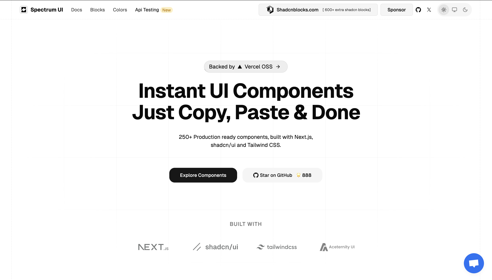

<div align="center">
  <h1>Spectrum UI</h1>
<a href="https://x.com/arihantCodes">
Follow Us on X
</a>
  
</div>
<div align="center">
<br />
<br />
<a href="https://vercel.com/oss">
  
</a>
</div>
<br />





## Contributing to Spectrum UI

Thank you for your interest in contributing to Spectrum UI! 🎉  
We value contributions from the community, whether it's a bug fix, a new feature, or an enhancement. Your input helps us grow and improve the library.

---

### How to Contribute

Follow these steps to get started with contributing to Spectrum UI:

---

#### 1. **Fork the Repository**

Click the "Fork" button at the top-right of the repository page to create your own copy of the project.

---

#### 2. **Clone Your Fork**

Clone your forked repository to your local machine:

```bash
git clone https://github.com/arihantcodes/spectrum-ui.git
cd spectrum-ui
```

---

#### 3. **Install Dependencies**

Run the following command to install the project's dependencies:

```bash
npm install
```

---

#### 4. **Start the Development Server**

Run the development server to test your changes locally:

```bash
npm run dev
```

---

#### 5. **Create a New Branch**

Create a branch for your feature or fix:

```bash
git checkout -b feature-name
```

---

#### 6. **Make Your Changes**

Edit the code to implement your feature or fix the bug.

---

#### 7. **Commit Your Changes**

After making your changes, commit them with a descriptive message:

```bash
git commit -m "Add feature-name"
```

---

#### 8. **Push Your Changes**

Push your branch to your forked repository:

```bash
git push origin feature-name
```

---

#### 9. **Create a Pull Request (PR)**

- Go to the [Pull Requests](https://github.com/your-username/spectrum-ui/pulls) section of the original repository.
- Click **"New Pull Request"**.
- Select your branch and submit your PR.
- Provide a clear description of your changes, including why they are beneficial.

---

## Star History

[](https://www.star-history.com/#arihantcodes/spectrum-ui&Date)


### Contributors

Thanks to all the amazing contributors who have helped improve Spectrum UI! 💖

<div align="center">


</div>


hi

